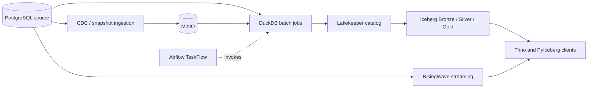

# Kest architecture

Kest separates reusable platform mechanics, data-product logic, orchestration,
and local deployment. This keeps business rules testable without Airflow or
Docker and lets a new workload reuse the platform without importing an existing
domain.

## Code boundaries

`src/kest` contains small primitives shared by workloads: S3 clients and
immutable writes, Iceberg catalog helpers, table-file operations, and atomic
publication pointers. This package receives a settings object from its caller;
it does not read CyberMarket or DeliveryOps configuration.

`workloads/<name>` is a complete data product. It owns source schema and sample
data, ingestion rules, transformations, data-quality checks, governance
contracts, and CLI entry points. A workload can import `kest`; `kest` never
imports a workload. Workloads do not import one another.

`orchestration/airflow/dags` contains TaskFlow graphs. A task calls a stable
Python entry point in a workload. The DAG controls dependency, retry, timeout,
and schedule behavior while business logic stays in ordinary Python modules.

`deploy/local` owns the Docker Compose topology and service configuration. The
core file defines stateful platform services. Overlay files add optional shared
services and workload-specific runtimes. Keeping the Compose project name and
volume names stable preserves existing local data after code moves.

## Data layers

| Layer | Contract |
| --- | --- |
| Source | Mutable operational PostgreSQL tables and logical WAL |
| Landing | Immutable raw CDC payloads plus commit manifests; uncommitted files are ignored |
| Bronze | Source-shaped history or batch snapshots in Parquet/Iceberg |
| Silver | Typed, deduplicated, conformed facts and dimensions with rejected rows separated |
| Gold | Business-facing metrics and marts with explicit grain |
| Publication | One pointer identifies the complete set of table snapshots for a successful run |

Lakekeeper is the Iceberg REST catalog and MinIO stores table metadata and data
files. DuckDB performs finite local batch transforms. RisingWave owns the live
streaming path. Trino gives users one SQL entry point over PostgreSQL and the
cataloged lakehouse.

CyberMarket first writes reproducible historical Parquet and committed raw CDC,
then publishes stable Silver and Gold tables. DeliveryOps stages its Bronze,
Silver, and Gold outputs under a run ID, applies source and quality gates, and
publishes the run only after every required table succeeds. Both paths keep the
last complete publication readable if a later run fails.

## Runtime profiles

The core `deploy/local/compose.yaml` file starts PostgreSQL sources and metadata,
MinIO, Lakekeeper, RisingWave, and Airflow. `compose.platform.yaml` adds NiFi,
Debezium Server, and Trino. Each workload overlay adds only its job runtime or
domain-specific source. Make targets always combine these files with the same
project directory, so relative mounts and `.env` resolution do not depend on the
caller's current directory.

Long-running platform services keep named volumes. Batch, validation, generator,
and setup jobs use disposable containers built from the locked
`requirements.txt`. Mounted source directories make branch changes immediately
visible without baking application code into a new image.

## Adding a workload

Create `workloads/<name>` with a settings module, one explicit CLI, source and
transform modules, validation, contracts, and a README. Add a job service in a
new `deploy/local/compose.<name>.yaml` overlay and expose lifecycle targets in the
Makefile. Add a TaskFlow DAG only when orchestration adds dependency or schedule
value. Put generic S3 or Iceberg behavior in `src/kest` after at least two
workloads need the same semantics; keep domain schemas and SQL in the workload.

The minimum acceptance path is: Compose renders, imports and formatting pass,
unit tests pass, source setup is idempotent, one finite batch publishes, and the
workload validator reads the published result through the catalog.
