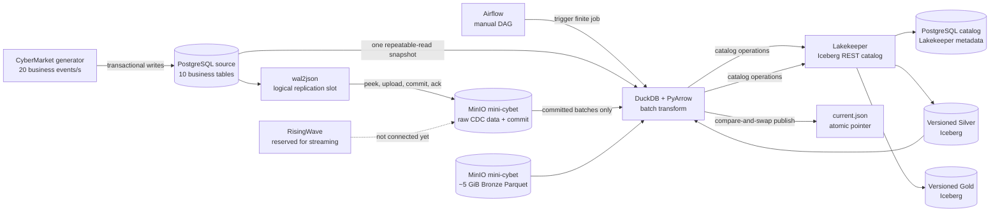

# Kiến trúc và luồng xử lý dữ liệu Kest

Tài liệu này mô tả trạng thái đang được triển khai trong repository: hạ tầng local,
mô hình CyberMarket, đường đi của dữ liệu và các bảo đảm khi chạy CDC hoặc batch.
Các thành phần được mô tả ở đây đều đã có code và lệnh vận hành tương ứng.

## 1. Phạm vi hiện tại

Kest mô phỏng một nền tảng dữ liệu local theo kiến trúc lakehouse. PostgreSQL là
nguồn giao dịch, MinIO giữ raw/Parquet/Iceberg, Lakekeeper quản lý Iceberg REST
catalog, DuckDB thực hiện batch transform và Airflow điều phối batch thủ công.
RisingWave đã có trong hạ tầng để dùng cho streaming ở giai đoạn sau nhưng chưa
tham gia vào đường xử lý batch hiện tại.

Hệ thống có bốn vùng dữ liệu:

| Vùng | Định dạng | Mục đích |
| --- | --- | --- |
| Landing raw | JSON Lines nén gzip | Nhật ký CDC bất biến, giữ nguyên payload từ WAL |
| Bronze | Parquet nén Zstandard | Lịch sử khoảng 5 GiB, có thể sinh lại và tiếp tục an toàn |
| Silver | Iceberg | 10 bảng có cấu trúc nguồn và một bảng audit CDC đã khử trùng lặp |
| Gold | Iceberg | Bốn data mart đã tổng hợp để truy vấn nghiệp vụ |

## 2. Sơ đồ thành phần



Ba PostgreSQL được tách riêng theo trách nhiệm:

- `postgres-source` giữ dữ liệu CyberMarket và WAL logical replication.
- `postgres-airflow` giữ metadata điều phối của Airflow.
- `postgres-catalog` giữ metadata catalog của Lakekeeper.

Các service trao đổi trong mạng Docker `kest-net`. Chỉ giao diện cần dùng từ máy
host mới bind vào `127.0.0.1`. Workload chạy trong container dùng một lần; generator
và CDC không tự chạy nền sau khi test kết thúc.

## 3. Mô hình dữ liệu CyberMarket

Mười bảng nguồn được chia thành dimension và fact:

| Nhóm | Bảng | Grain chính |
| --- | --- | --- |
| Dimension | `markets` | Một marketplace |
| Dimension | `vendors` | Một người bán |
| Dimension | `buyers` | Một người mua |
| Dimension | `products` | Một sản phẩm theo composite key |
| Fact | `transactions` | Một giao dịch mua |
| Fact | `transaction_products` | Một dòng sản phẩm trong giao dịch |
| Fact | `BuyerSessionAnalytics` | Một phiên truy cập của buyer |
| Fact | `PaymentProcessingEvents` | Trạng thái thanh toán của giao dịch |
| Fact | `risk_analytics` | Điểm rủi ro tại thời điểm giao dịch |
| Fact | `RiskModelPredictions` | Một lần dự đoán của mô hình |

Miền khóa cố định gồm 10 market, 1.000 vendor, 10.000 buyer và 4.000 product.
Mỗi vendor có bốn product. Product dùng composite key gồm `ProdCat`,
`Subcategory`, `ListingAge`, `SellerPointer`. ID lịch sử chứa `HIST`; ID phát sinh
trực tiếp chứa `LIVE` và UUID, nên hai nguồn không đụng khóa nhau.

PostgreSQL giữ đúng tên cột, kiểu thô, mixed case và JSONB của hợp đồng nguồn.
Các constraint kiểm tra quan hệ nhân quả của session, state machine thanh toán,
biên giới giao dịch và nhãn rủi ro. Index tập trung vào khóa join và chiều thời
gian thường dùng trong batch.

## 4. Logic nghiệp vụ phát sinh dữ liệu trực tiếp

Generator chạy một frame cố định gồm 20 business event mỗi giây:

| Loại event | Số lần/giây | Tác động nghiệp vụ |
| --- | ---: | --- |
| `buyer_session` | 8 | Ghi hành vi duyệt, giỏ hàng và checkout |
| `purchase` | 6 | Tạo giao dịch, hai dòng hàng, payment authorized và risk; cập nhật buyer/vendor |
| `payment_update` | 3 | Chuyển payment authorized sang settled hoặc failed |
| `risk_prediction` | 2 | Ghi kết quả dự đoán cho một giao dịch gần đây |
| `transaction_status_update` | 1 | Chuyển giao dịch completed sang fulfilled khi đủ điều kiện |

Một `purchase` là một PostgreSQL transaction duy nhất. Nó chọn hai trong bốn sản
phẩm của vendor, chia tổng tiền theo tỷ lệ 45/55, tạo payment ở trạng thái
`authorized` với `amount_processed = 0`, tạo risk row, tăng purchase count của
buyer và chỉ tăng `TotalTxns` của vendor.

`payment_update` là bước quyết định kết quả:

- Fraud score từ 0,8 trở lên hoặc xác suất lỗi mô phỏng 5% tạo trạng thái
  `failed`; số tiền xử lý bằng 0, có `decline_reason` và tăng `retry_count`.
- Trường hợp còn lại tạo trạng thái `settled`; số tiền xử lý bằng số tiền yêu
  cầu, không có decline reason và `CompletedTxns` của vendor mới được tăng.
- JSON trạng thái giao dịch chuyển sang `failed` hoặc `completed` cùng lần cập
  nhật payment. Chỉ giao dịch `completed` mới có thể chuyển tiếp sang `fulfilled`.

Session luôn thỏa `cart_removals <= cart_additions`. Checkout hoàn tất bắt buộc
đã khởi tạo checkout. Bounce chỉ đúng khi phiên có một page và không thêm hàng.
Nhãn risk/prediction được suy ra trực tiếp từ xác suất: thấp dưới 0,3; trung bình
từ 0,3 đến dưới 0,7; cao từ 0,7 trở lên.

## 5. CDC và Landing raw

CDC dùng replication slot `wal2json`. Writer đọc bằng `peek` để WAL chưa bị xác
nhận trước khi dữ liệu được lưu an toàn. Với mỗi batch, quy trình là:

1. Chuẩn hóa từng WAL change thành event có `event_id` xác định từ database, LSN,
   XID và raw payload.
2. Nhóm event theo bảng và ghi vào
   `landing/postgres-source/data/<table>/batch-<sha256>.jsonl.gz`.
3. Dùng key, JSON ordering và gzip timestamp xác định để retry tạo đúng cùng byte.
4. Ghi completion manifest vào
   `landing/postgres-source/commits/<sha256>.json` sau khi mọi data object thành công.
5. Chỉ sau completion manifest mới gọi `get_changes` để xác nhận WAL slot.

Các object data và commit dùng conditional PUT `If-None-Match: *`. Nếu retry gặp
object đã tồn tại, writer so sánh toàn bộ payload và chỉ chấp nhận khi giống hệt.
MinIO bucket bật versioning. Reader chỉ đọc batch có completion manifest, kiểm tra
SHA-256 và số event của từng object, rồi khử trùng lặp theo `event_id`. Vì vậy một
lần chạy dở có thể để lại data object nhưng không bao giờ được xem là batch hợp lệ.

## 6. Bronze lịch sử

`make history` sinh Parquet xác định và có thể tiếp tục từ phần đã hoàn thành.
Mỗi part khoảng 128 MiB, dùng Zstandard và có metadata gồm số part, khoảng row,
row count, schema SHA-256 và content SHA-256. Manifest liệt kê chính xác mọi file,
ETag, kích thước, checksum, schema fingerprint và tổng số row/byte.

29% mục tiêu byte được dùng để xác định cardinality `transactions`. Các fact còn
lại được suy ra từ số transaction thực tế:

| Bảng | Tỷ lệ row |
| --- | ---: |
| `transaction_products` | 2 × transaction |
| `BuyerSessionAnalytics` | 4/3 × transaction |
| `PaymentProcessingEvents` | 1 × transaction |
| `risk_analytics` | 1 × transaction |
| `RiskModelPredictions` | 1/3 × transaction |

Toàn bộ bốn product của mỗi vendor xuất hiện trong lịch sử bán hàng. Payment có
cả settled và failed; session, payment và risk dùng cùng quy tắc như luồng live.
Khi resume, part phải liên tục từ row 1, không gap, không overlap và cùng schema
fingerprint. Một lần chạy không tạo thêm part sẽ giữ nguyên manifest, tránh tạo
phiên bản object thừa. `make history-reset` chỉ thay fixture Bronze có thể tái tạo;
bucket versioning vẫn giữ các phiên bản trước để phục hồi.

## 7. Batch Bronze → Silver → Gold

Airflow DAG `cybermarket_batch` không có schedule và chỉ cho một active run. Task
đầu chạy toàn bộ publish, task sau xác thực kết quả. Chạy trực tiếp bằng `make batch`
và chạy qua Airflow bằng `make batch-airflow` đều gọi cùng một implementation.

Mỗi batch thực hiện theo thứ tự:

1. Đọc và xác thực Bronze manifest cùng danh sách Parquet.
2. Mở một PostgreSQL transaction `REPEATABLE READ, READ ONLY`, lấy LSN/timestamp
   rồi đọc cả 10 bảng trong cùng snapshot.
3. Đọc duy nhất các CDC commit hoàn chỉnh, kiểm checksum và khử trùng lặp.
4. Tạo namespace mới `silver_<batch-id>` và ghi 10 bảng nguồn cùng `cdc_events`.
5. Dùng DuckDB đọc file Silver của đúng namespace đó để tính bốn bảng Gold vào
   namespace mới `gold_<batch-id>`.
6. Kiểm row count trong lúc build, ghi batch manifest bất biến, rồi cập nhật
   `iceberg/_kest_batches/current.json` bằng compare-and-swap.

Dimension Silver lấy snapshot PostgreSQL hiện tại. Fact Silver là lịch sử Bronze
cộng snapshot PostgreSQL nhất quán. JSONB được biểu diễn bằng JSON string trong
Iceberg. `cdc_events` là bảng audit chứa event ID, table, operation, LSN, XID,
timestamp và raw change JSON; property của bảng ghi checkpoint LSN cao nhất đã
đọc. CDC audit chưa được cộng lần nữa vào fact Silver, tránh nhân đôi các thay đổi
đã có trong snapshot PostgreSQL.

## 8. Mô hình Gold

| Bảng | Grain | Chỉ số chính |
| --- | --- | --- |
| `daily_market_metrics` | Ngày, platform | transaction, buyer/vendor duy nhất, GMV, cross-border, high-risk, payment failed |
| `vendor_risk_summary` | Vendor | transaction, buyer, GMV, xác suất fraud trung bình, lần giao dịch cuối |
| `buyer_360` | Buyer | transaction, session, checkout hoàn tất, lifetime value, lần mua cuối |
| `product_performance` | Composite product key | transaction, unit sold, gross revenue |

Tiền trong Gold được cast về `DECIMAL`; timestamp tổng hợp dùng kiểu có timezone
và DuckDB chạy theo UTC. Gold luôn lưu property trỏ về đúng Silver namespace đã
dùng để tính, nên có thể truy ngược lineage của một kết quả.

## 9. Publish atomic, lỗi và phục hồi

Silver và Gold của một batch được ghi vào namespace mới, không sửa namespace mà
consumer đang đọc. Batch manifest cũng dùng immutable PUT. Bước cuối mới thay
`current.json` bằng điều kiện ETag đã đọc ở đầu batch:

- Nếu một publisher khác đã thay pointer, conditional PUT thất bại và batch hiện
  tại không thể ghi đè kết quả mới hơn.
- Nếu lỗi trước khi publish pointer, namespace Silver/Gold vừa tạo được xóa và
  pointer cũ vẫn có hiệu lực.
- Nếu publish thành công, consumer thấy đồng thời cặp namespace Silver/Gold hoàn
  chỉnh qua một pointer duy nhất.
- Namespace phiên bản cũ được giữ lại để rollback; việc dọn retention là thao tác
  vận hành riêng.

Consumer phải đọc `iceberg/_kest_batches/current.json`, lấy `silver_namespace`,
`gold_namespace` và `manifest_key`, sau đó truy vấn các bảng trong namespace được
chỉ định. Không nên hard-code namespace `silver` hoặc `gold` cũ.

## 10. Kiểm tra end-to-end

Các lớp kiểm tra tương ứng với từng trạng thái:

```sh
make workload-check              # schema, seed, constraint và semantic nguồn
make workload-check-history      # manifest/file inventory của Bronze
make workload-check-history-deep # quét toàn bộ fact history bằng DuckDB
make workload-check-cdc          # slot, commit protocol, checksum, LSN và event ID
make batch-check                 # pointer, lineage, schema, count và Gold rollup
make cdc-test                    # phát 20 event, land raw, kiểm tra rồi dừng
make airflow-dag-check            # DAG được parse và không có import error
make test                         # unit test quy tắc và resume history
```

`batch-check` bắt đầu từ current pointer, kiểm batch manifest, namespace, table
property, source LSN, Bronze checksum, CDC checkpoint và row count. Nó cũng đối
chiếu tổng transaction ở ba mart với Silver, và tổng unit của product mart với
`transaction_products`. Deep history check quét toàn bộ dữ liệu fact để phát hiện
mâu thuẫn session, payment, risk/prediction và bảo đảm đủ miền 4.000 product.

## 11. Ranh giới production

Đây là môi trường local. Cấu hình hiện dùng MinIO root credential, Lakekeeper
`allowall`, Airflow simple auth và HTTP trên loopback. Khi triển khai production
cần tách service identity, dùng secret manager, TLS/OIDC, chính sách retention,
backup/restore được kiểm thử, quan sát tập trung và cơ chế quản lý Iceberg orphan
files. Những bảo đảm hiện có tập trung vào tính đúng đắn và khả năng lặp lại của
pipeline dữ liệu local.
