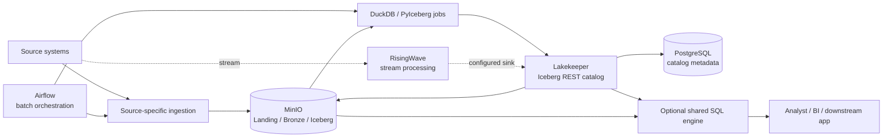

# Hướng dẫn sử dụng Kest như một data platform

Tài liệu này đánh giá Kest khi **không tính CyberMarket workload mẫu** và hướng
dẫn cách đưa một source system mới vào nền tảng. Mục tiêu là trả lời rõ:

1. Hạ tầng hiện tại cung cấp gì cho người dùng?
2. Một source mới phải đi qua những bước nào để ingest, transform và sử dụng?
3. Việc nào làm được ngay ở local, việc nào cần thêm component?

## 1. Trạng thái hiện tại

Kest hiện là một **data-platform foundation chạy được ở local**, chưa phải sản
phẩm data platform self-service hoàn chỉnh.

Nền tảng đã có:

- PostgreSQL riêng cho metadata Airflow và metadata Lakekeeper.
- MinIO làm S3-compatible object storage.
- Lakekeeper làm Iceberg REST catalog.
- Airflow làm batch orchestrator.
- RisingWave làm streaming engine single-node.
- NiFi làm ingestion canvas và ghi event sang Landing/Bronze.
- Debezium Server làm PostgreSQL CDC bridge tùy chọn.
- Trino làm shared SQL engine cho Iceberg và PostgreSQL.
- DuckDB, PyArrow, PyIceberg, S3FS và Psycopg để viết job.

Nền tảng chưa có:

- màn hình **Add source**;
- source registry và schema registry dùng chung;
- connector registry/control-plane tổng quát cho nhiều loại source;
- secret manager;
- framework quản lý SQL model như dbt;
- custom Add Source API độc lập với NiFi canvas;
- monitoring cho freshness, CDC lag, schema drift và data quality.

Vì vậy, ở trạng thái hiện tại:

- Data engineer có thể thêm source bằng code, cấu hình container và Airflow DAG.
- Analyst chưa thể tự bấm một form Add source; operator/data engineer có thể copy
  NiFi flow và cấu hình connector theo contract.
- Lakekeeper UI dùng để xem/quản lý catalog; nó không kéo dữ liệu nguồn và không
  phải SQL warehouse.
- Airflow UI dùng để chạy và theo dõi DAG đã viết sẵn; nó không tự sinh connector.
- MinIO Console dùng để quan sát object, không phải quy trình ingest.

**Không cần lên production để thêm source.** Có thể phát triển và kiểm thử toàn
bộ integration ở local. Chỉ cần thêm service khi source hoặc người dùng yêu cầu
tiến trình luôn chạy, message broker, query server hoặc giao diện self-service.

## 2. Thành phần và trách nhiệm



| Thành phần | Vai trò | Không dùng để |
| --- | --- | --- |
| MinIO | Giữ raw object, Parquet và file Iceberg | Chạy business SQL |
| Lakekeeper | Quản lý namespace, table, snapshot và Iceberg metadata | Kéo source hoặc chạy transform |
| Airflow | Lập lịch, retry và theo dõi finite batch job | Chạy daemon CDC vô hạn |
| RisingWave | Nền tảng streaming SQL | Tự tạo source/sink khi chưa cấu hình |
| DuckDB/PyArrow | Batch transform và kiểm tra file | Shared query server |
| PyIceberg | Tạo, đọc và commit Iceberg table | Orchestration |
| PostgreSQL Airflow | Metadata nội bộ Airflow | Lưu business data |
| PostgreSQL catalog | Metadata nội bộ Lakekeeper | Lưu business data |

`postgres-source` trong Compose là source local hiện có. Một PostgreSQL mới bên
ngoài Kest không cần được dựng thành service Compose khác. Connector chỉ cần truy
cập được hostname và port của source đó.

## 3. Ai sử dụng platform bằng cách nào?

### Platform operator

Operator khởi động hạ tầng, quản lý network, credentials, catalog, resource,
backup và trạng thái service.

```sh
make start
docker compose ps
```

Các endpoint trên host:

| Dịch vụ | Endpoint |
| --- | --- |
| Lakekeeper UI/API | `http://127.0.0.1:8181` |
| MinIO API | `http://127.0.0.1:9000` |
| MinIO Console | `http://127.0.0.1:9001` |
| Airflow UI/API | `http://127.0.0.1:8080` |
| RisingWave PostgreSQL protocol | `127.0.0.1:4566` |
| NiFi UI | `https://127.0.0.1:8090/nifi/` |
| Trino HTTP/JDBC | `127.0.0.1:8081` |

### Data engineer

Data engineer viết source adapter, raw contract, schema mapping, Iceberg
transform, validation và Airflow DAG. Đây là cách thêm source trong phiên bản
hiện tại.

### Analyst hoặc BI user

Analyst dùng Trino để query Iceberg bằng SQL hoặc JDBC sau khi data engineer
publish table. Lakekeeper trả catalog metadata và hỗ trợ table access; nó không
nhận SQL như database warehouse. Xem quy trình thao tác tại
[NIFI_TRINO_USAGE.md](NIFI_TRINO_USAGE.md).

## 4. Quy trình chuẩn để thêm source

### Bước 1: Viết source contract

Không bắt đầu bằng connector. Trước tiên cần chốt:

| Thuộc tính | Ví dụ |
| --- | --- |
| Source name | `erp_orders` |
| Owner | Team ERP |
| Source type | PostgreSQL 16 |
| Endpoint | `erp-db.internal:5432` |
| Database/schema | `erp/public` |
| Tables | `orders`, `order_items`, `customers` |
| Primary key | `orders.id`, `order_items.id`, `customers.id` |
| Ingestion mode | Initial snapshot + CDC |
| Expected volume | 20 GiB initial, 500 MiB/day |
| Freshness | Dưới 5 phút |
| Delete semantics | Hard delete tạo tombstone |
| Schema evolution | Additive tự động; breaking change phải review |
| Data classification | Email và phone là restricted |
| Retention | Raw 30 ngày, Bronze 90 ngày |
| Replay cursor | PostgreSQL LSN |

Source không có primary key hoặc replay cursor cần chiến lược riêng. Không dùng
row order hoặc thời gian ingest làm identity duy nhất vì retry sẽ sinh duplicate.

### Bước 2: Chọn ingestion mode

| Source | Mode | Component cần |
| --- | --- | --- |
| Bảng nhỏ, freshness theo ngày | Full snapshot | Airflow task/job |
| Bảng lớn có `updated_at` ổn định | Incremental batch | Airflow + checkpoint |
| PostgreSQL cần freshness vài phút | Logical CDC | CDC worker luôn chạy |
| CSV/Parquet định kỳ | File ingestion | Sensor/poller hoặc notification |
| REST/SaaS API | Cursor polling | Airflow task thường đủ |
| Kafka topic có sẵn | Streaming | RisingWave connector hoặc stream worker |
| Event stream chưa có broker | Streaming | Thêm Kafka/Redpanda hoặc broker khác |

Full snapshot đơn giản nhưng tốn IO và khó giữ delete semantics. Incremental
batch phải lưu watermark cùng commit. CDC có freshness tốt nhưng cần quản lý slot,
WAL retention, schema change và tiến trình liên tục.

### Bước 3: Chuẩn bị network

Connector chạy trong Docker network `kest-net`. Source phải truy cập được từ
container, không chỉ từ host.

Kiểm tra:

1. DNS/IP của source resolve được trong container.
2. Firewall cho phép container host kết nối source port.
3. TLS certificate có CA chain connector tin cậy.
4. Timeout và source connection limit phù hợp.
5. Không dùng `127.0.0.1` cho source nằm ngoài chính container.

Nếu source là service Compose, dùng service name. Nếu source nằm ngoài Docker,
dùng DNS/IP mà container truy cập được. Không hard-code địa chỉ production vào
source code.

### Bước 4: Tạo service account

Credentials nằm trong `.env` ở local hoặc secret manager ở production. Không
commit password, access key hoặc connection string.

Ví dụ quyền read-only cho PostgreSQL snapshot:

```sql
CREATE ROLE kest_erp_reader LOGIN PASSWORD '<secret>';
GRANT CONNECT ON DATABASE erp TO kest_erp_reader;
GRANT USAGE ON SCHEMA public TO kest_erp_reader;
GRANT SELECT ON orders, order_items, customers TO kest_erp_reader;
ALTER DEFAULT PRIVILEGES IN SCHEMA public
    GRANT SELECT ON TABLES TO kest_erp_reader;
```

Nếu dùng logical CDC qua Debezium/NiFi, source PostgreSQL phải:

- bật `wal_level=logical`;
- có đủ `max_replication_slots` và `max_wal_senders`;
- hỗ trợ output plugin chuẩn `pgoutput`;
- cấp quyền replication;
- đặt WAL retention limit và theo dõi lag.

```sql
ALTER ROLE kest_erp_reader WITH REPLICATION;
```

Không dùng owner hoặc superuser cho connector production.

### Bước 5: Quy hoạch object

Mỗi source dùng prefix riêng:

```text
s3://<bucket>/
  landing/<source-name>/
    data/<stream-or-table>/batch-<content-id>.jsonl.gz
    commits/<content-id>.json
  bronze/<source-name>/<table>/...
  iceberg/...
```

Quy tắc landing:

1. Raw payload giữ đủ source metadata để replay.
2. Data object là immutable.
3. Batch ID xác định từ source position hoặc nội dung.
4. Ghi tất cả data object trước.
5. Ghi một commit manifest sau cùng.
6. Chỉ checkpoint/ack source sau khi manifest thành công.
7. Reader bỏ qua object không có commit.
8. Manifest chứa key, record count, checksum và source range.

Ví dụ commit manifest:

```json
{
  "schema_version": 1,
  "source": "erp_orders",
  "batch_id": "<deterministic-id>",
  "source_range": {
    "first": "0/16B6C50",
    "last": "0/16B7A20"
  },
  "objects": [
    {
      "key": "landing/erp_orders/data/orders/batch-<id>.jsonl.gz",
      "record_count": 1200,
      "sha256": "<sha256>"
    }
  ]
}
```

Bucket local hiện tại là `mini-cybet`. Không cần một MinIO service hoặc bucket
mới cho từng source. Production có thể tách bucket theo environment và mức độ
nhạy cảm.

### Bước 6: Implement ingestion adapter

Kest chưa có interface generic bắt buộc. Với integration thật, nên tạo package:

```text
integrations/
  erp_orders/
    config.py
    schema.py
    extract.py
    landing.py
    checkpoint.py
    validate.py
```

Đây là cấu trúc khuyến nghị; repository hiện chưa tự phát hiện nó. Cần copy hoặc
mount package vào image chạy job và khai báo dependency trong `requirements.in`.

Adapter cần:

- import module không tự mở connection;
- đọc config khi process bắt đầu;
- retry không tạo duplicate;
- không log secret hoặc raw PII;
- có connection/request timeout;
- giới hạn batch size;
- đóng connection khi nhận `SIGTERM`;
- trả exit code khác 0 nếu batch không commit;
- log source range, batch ID, record count và duration.

#### Snapshot

Snapshot nên dùng transaction nhất quán:

```sql
BEGIN TRANSACTION ISOLATION LEVEL REPEATABLE READ READ ONLY;
SELECT pg_current_wal_lsn();
-- Đọc các bảng thuộc cùng snapshot.
COMMIT;
```

Bảng lớn chia chunk theo primary key. Không dùng `OFFSET` vì source thay đổi có
thể gây gap/duplicate và chi phí tăng theo trang.

#### Incremental batch

Watermark phải sắp xếp duy nhất, ví dụ `(updated_at, id)`:

1. Đọc checkpoint của batch đã commit gần nhất.
2. Chốt upper bound ở đầu batch.
3. Đọc `checkpoint < (updated_at, id) <= upper_bound`.
4. Ghi object và commit manifest.
5. Cập nhật checkpoint bằng compare-and-swap.

#### CDC

CDC connector lưu offset riêng và đẩy envelope vào durable NiFi flow. Slot name
gắn với source và environment. Hai consumer cần checkpoint độc lập thì không
dùng chung một slot. Workload mẫu cũ vẫn dùng protocol `wal2json` riêng với
commit manifest; hai đường không dùng chung replication slot.

Không chạy logical CDC vô hạn trong Airflow task. Local có thể dùng một Compose
profile/service chạy foreground. Production chạy worker dưới container
orchestrator với restart policy, health probe và alert lag.

### Bước 7: Initial snapshot và CDC handoff

Để không mất thay đổi giữa snapshot và CDC:

1. Tạo hoặc xác định CDC slot/checkpoint.
2. Chốt snapshot position.
3. Chạy initial snapshot nhất quán.
4. Publish snapshot Bronze.
5. Đọc thay đổi sau snapshot position.
6. Deduplicate theo source primary key và event identity.

Không snapshot trước rồi vài giờ sau mới tạo slot; thay đổi ở khoảng giữa sẽ mất.

### Bước 8: Schema và schema evolution

| Layer | Nguyên tắc |
| --- | --- |
| Landing | Giữ payload và source metadata để replay |
| Bronze | Typed data, ingestion metadata và delete marker |
| Silver | Chuẩn hóa timezone, decimal, key, nullability, business state |
| Gold | Grain và metric phục vụ use case |

Bronze nên có metadata tương đương:

```text
_source_system
_source_table
_source_position
_source_timestamp
_ingested_at
_batch_id
_operation
_is_deleted
```

Schema evolution:

- Add nullable column: có thể tự động sau validation.
- Widen numeric/string: review rồi migrate.
- Rename/drop/change meaning: breaking change.
- Thay primary key: cần migration và replay plan.
- Type sai contract: quarantine batch, không publish một phần.

### Bước 9: Tạo Iceberg namespace và table

Lakekeeper quản lý namespace/table logic; MinIO giữ file vật lý. Ví dụ:

```text
bronze_erp
silver_sales
gold_commerce
```

Job trong Docker dùng:

```text
PYICEBERG_CATALOG__KEST__TYPE=rest
PYICEBERG_CATALOG__KEST__URI=http://lakekeeper:8181/catalog
PYICEBERG_CATALOG__KEST__WAREHOUSE=kest-local
PYICEBERG_CATALOG__KEST__S3__ENDPOINT=http://minio:9000
PYICEBERG_CATALOG__KEST__S3__PATH_STYLE_ACCESS=true
```

Lakekeeper UI và API kiểm tra từ host dùng `http://127.0.0.1:8181`; MinIO dùng
`http://127.0.0.1:9000`. PyIceberg job hiện nên chạy trong `kest-net`, vì catalog
trả internal URI `http://lakekeeper:8181/catalog`. Nếu buộc chạy PyIceberg trực
tiếp trên host, cần cấu hình DNS/hosts hoặc reverse proxy để hostname trong URI
catalog resolve được từ cả host lẫn container.

Không tạo thư mục Silver/Gold bằng tay trong MinIO. Tạo namespace/table qua
Lakekeeper/PyIceberg để catalog và Iceberg metadata nhất quán.

### Bước 10: Implement transform

Batch transform bằng DuckDB + PyArrow + PyIceberg:

1. Resolve input table/snapshot từ Lakekeeper.
2. Chỉ đọc committed Landing/Bronze input.
3. Transform bằng DuckDB SQL hoặc Arrow.
4. Ghi Iceberg table/version mới.
5. Kiểm schema, row count, key và business invariant.
6. Commit snapshot.
7. Chỉ publish pointer/version sau khi mọi output hợp lệ.

Mỗi transform phải khai báo:

- input table và input snapshot/watermark;
- output grain và business key;
- dedup và delete rule;
- timezone và monetary precision;
- late-arriving data window;
- backfill/replay behavior;
- data-quality checks, owner và SLA.

Ví dụ Silver contract:

```text
Table: silver_sales.orders
Grain: one row per order_id
Key: order_id
Dedup: greatest(source_lsn), then greatest(source_timestamp)
Delete: latest delete event sets _is_deleted=true
Money: DECIMAL(18,2)
Time: TIMESTAMP WITH TIME ZONE in UTC
Late arrival: reprocess last 24 hours
Checks: unique order_id, customer_id not null, amount >= 0
```

RisingWave chỉ được chọn khi cần cập nhật liên tục và source/sink đã cấu hình.
Service đang chạy không làm streaming table tự xuất hiện. Cần tạo source,
table/materialized view, sink/checkpoint và recovery test.

### Bước 11: Orchestrate bằng Airflow

Airflow DAG chỉ nên orchestration; business logic nằm trong package riêng.

```text
check_source_connectivity
        |
extract_or_snapshot
        |
validate_landing_commit
        |
publish_bronze
        |
build_silver
        |
validate_silver
        |
build_gold
        |
publish_current_pointer
```

Mỗi task cần:

- finite runtime;
- retry chỉ khi idempotent;
- execution timeout;
- explicit dependency;
- source/batch ID trong log;
- không truyền secret qua command-line;
- failure giữ nguyên version đang active;
- backfill nhận time range hoặc source range rõ ràng.

DAG đặt trong `docker/airflow/dags/`. Integration code phải có trong Airflow image
hoặc mount read-only vào container.

```sh
make airflow-dag-check
```

Trước khi bật production schedule, chạy ít nhất một initial load, một incremental
hoặc CDC batch, một retry và một failure/recovery test.

### Bước 12: Validate trước publish

| Nhóm | Check tối thiểu |
| --- | --- |
| Source | Snapshot position, source range, connectivity |
| Landing | Commit, object inventory và checksum |
| Identity | Event ID/business key duplicate |
| Schema | Column, type, nullability, compatibility |
| Referential | Child tham chiếu parent hoặc nằm trong late window |
| Semantic | Amount, state transition, timestamp ordering |
| Reconciliation | Count/sum theo cùng watermark |
| Freshness | Watermark đáp ứng SLA |
| Publish | Output dùng cùng batch ID và input snapshot |

Batch lỗi phải để current version cũ tiếp tục phục vụ. Không publish từng table
vào namespace consumer đang đọc.

### Bước 13: Cho người dùng truy vấn

#### Python/PyIceberg

Phù hợp data engineer, notebook hoặc Python service. Client kết nối Lakekeeper,
resolve table rồi scan snapshot.

#### DuckDB

Phù hợp ad-hoc local, test và finite transform. DuckDB không phải server nhiều
người dùng.

#### Shared SQL engine

Phù hợp analyst, BI và JDBC/ODBC. Profile tùy chọn hiện đã có Trino, cấu hình
Iceberg REST catalog tới Lakekeeper và S3 tới MinIO. BI kết nối Trino, không kết
nối trực tiếp Lakekeeper.

Nếu mục tiêu là “user đăng nhập, chọn source, viết SQL transform và publish”, cần
xây thêm product/control-plane. Lakekeeper và Airflow không tự cung cấp workflow
đó.

## 5. Ví dụ end-to-end: PostgreSQL ERP Orders

Giả sử source:

```text
Host: erp-db.internal:5432
Database: erp
Tables: customers, orders, order_items
Freshness: 5 phút
Initial size: 20 GiB
Change rate: 200 rows/second
```

### Giai đoạn A: Source

1. Xác nhận primary/foreign key.
2. Chốt money, currency, timestamp và delete semantics.
3. Tạo `kest_erp_reader` với SELECT + REPLICATION.
4. Bật logical WAL và dùng output plugin chuẩn `pgoutput`.
5. Đặt slot riêng `kest_erp_orders_prod`.
6. Đặt WAL retention và alert.
7. Kiểm tra kết nối từ `kest-net`.

### Giai đoạn B: Integration

1. Tạo package `integrations/erp_orders/`.
2. Đọc source config bằng environment variable.
3. Viết snapshot reader dùng một repeatable-read transaction.
4. Ghi snapshot theo primary-key chunk.
5. Viết CDC theo peek → immutable upload → manifest → ack.
6. Sinh event ID từ database + LSN + XID + raw payload.
7. Ghi checksum và source range.
8. Viết validator độc lập.
9. Test retry, conflicting payload và upload lỗi giữa batch.

### Giai đoạn C: Initial load và CDC

1. Tạo slot/checkpoint.
2. Chốt snapshot LSN.
3. Snapshot ba bảng trong cùng transaction.
4. Publish Bronze initial snapshot.
5. Đọc CDC sau snapshot LSN.
6. Test insert/update/delete một order.
7. Xác nhận raw event, checksum và completion manifest.
8. Xác nhận retry không tăng business event count.

### Giai đoạn D: Transform

1. Tạo/register Bronze Iceberg table.
2. Tạo Silver customers/orders/order_items.
3. Deduplicate theo primary key và LSN.
4. Apply tombstone.
5. Chuẩn hóa UTC và DECIMAL.
6. Reconcile count và amount tại cùng watermark.
7. Tạo Gold daily revenue/customer lifetime value nếu cần.
8. Publish version/pointer sau validation.

### Giai đoạn E: Orchestration và consumption

1. Airflow chạy snapshot/incremental finite task.
2. CDC worker là service riêng nếu cần freshness 5 phút.
3. Khai báo owner, timeout, retry và schedule.
4. Chạy failure/recovery test.
5. Data engineer kiểm bằng PyIceberg/DuckDB.
6. Thêm query engine nếu analyst cần SQL/JDBC.

Kết quả logic:

```text
Raw:    landing/erp_orders/...
Bronze: bronze_erp.customers, bronze_erp.orders, bronze_erp.order_items
Silver: silver_sales.customers, silver_sales.orders, silver_sales.order_items
Gold:   gold_commerce.daily_revenue
```

## 6. Khi nào cần thêm service?

| Nhu cầu | Cần service mới? | Lý do |
| --- | --- | --- |
| Snapshot PostgreSQL mỗi ngày | Không bắt buộc | Airflow finite task đủ |
| Poll REST API mỗi giờ | Không bắt buộc | Airflow + cursor đủ |
| Nhận CSV/Parquet để test | Không bắt buộc | One-shot loader đủ |
| CDC liên tục | Có | Worker có lifecycle riêng |
| Chưa có message broker | Có | Thêm broker hoặc dùng external |
| Streaming SQL | Không nếu RisingWave đủ | Vẫn cần source/sink config |
| Nhiều analyst dùng JDBC | Có | Cần shared query engine |
| dbt và SQL lineage | Thêm tool/container | dbt không nhất thiết là daemon |
| UI Add source | Có | Cần connector control-plane/registry |
| Secret production | Có hoặc managed service | Không dùng shared `.env` |
| Alert lag/freshness | Có hoặc external | Hiện chưa có monitoring stack |

## 7. Local và production

Local đủ để kiểm thử logic ingestion/transform. Production cần thêm:

- service identity riêng;
- TLS và secret manager;
- credential rotation;
- HA nếu SLA yêu cầu;
- backup/restore test;
- retention cho raw, orphan Iceberg file và version cũ;
- resource quota/autoscaling;
- monitoring source, slot lag, WAL, batch, freshness và quality;
- access control/audit;
- promotion dev → staging → production;
- rollback, replay và disaster-recovery runbook.

Production không tự giải quyết onboarding. Source contract, connector, checkpoint,
schema mapping, validation và ownership vẫn phải được thiết kế.

## 8. Definition of Done

- [ ] Có owner, SLA, classification và retention.
- [ ] Network/TLS và least-privilege account đã kiểm tra.
- [ ] Có primary key hoặc event identity đáng tin cậy.
- [ ] Snapshot/CDC handoff không mất dữ liệu.
- [ ] Raw immutable, có manifest và checksum.
- [ ] Retry không tạo duplicate/conflicting payload.
- [ ] Có schema evolution policy.
- [ ] Bronze/Silver contract có key, type, delete và timezone rule.
- [ ] Reconciliation và semantic validation tự động.
- [ ] Airflow finite task có retry/timeout.
- [ ] CDC daemon, nếu có, chạy ngoài Airflow task vô hạn.
- [ ] Có failure/recovery và backfill test.
- [ ] Consumer resolve đúng Iceberg table/version.
- [ ] Có client phù hợp: Python, DuckDB hoặc shared SQL engine.
- [ ] Có alert trước production.
- [ ] Có runbook dừng, replay, rollback và rotate credentials.

## 9. Lộ trình self-service

Nếu muốn user thêm source mà không sửa code:

1. Chuẩn hóa `SourceDefinition`, `DatasetContract` và source registry.
2. Tạo connector SDK chung cho snapshot, incremental, raw commit và checkpoint.
3. Tạo template sinh integration package và Airflow DAG.
4. Thêm secret manager.
5. Thêm shared query engine.
6. Thêm dbt/SQL model workflow nếu analyst tự quản transform.
7. Thêm monitoring và alert.
8. Sau khi contract/API ổn định mới xây UI Add source.

UI nên gọi các contract/API chuẩn. Xây UI trước connector runtime chỉ biến code
đặc thù của từng source thành code nằm sau một form.
