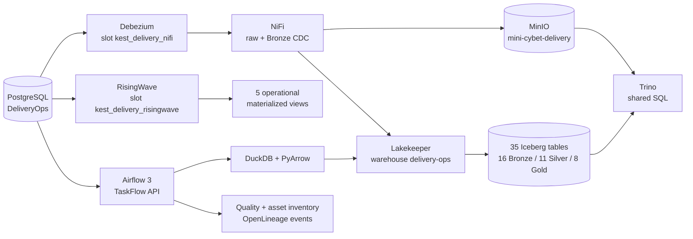

# DeliveryOps: kịch bản dữ liệu logistics từ nguồn đến data product

Tài liệu này mô tả source system DeliveryOps và toàn bộ đường xử lý đã được triển
khai trong Kest. Kịch bản này độc lập với CyberMarket: PostgreSQL, replication
slot, MinIO bucket, Lakekeeper warehouse, Iceberg namespace và catalog Trino đều
tách riêng. Các lệnh DeliveryOps không reset hay đọc dữ liệu workload hiện tại.

## 1. Bài toán

DeliveryOps mô phỏng hệ thống vận hành giao hàng chặng cuối ở quy mô vừa. Hệ
thống nguồn quản lý merchant, customer, courier, hub, shipment, route, lần giao,
phí và refund. Nhóm vận hành cần theo dõi backlog gần realtime; nhóm phân tích cần
SLA, hiệu suất hub/courier, chất lượng merchant, nguyên nhân giao thất bại và
doanh thu theo ngày.

Source mặc định có 25.000 shipment và hơn 200.000 row liên quan. Dữ liệu cố ý có
độ xấu vừa phải giống nguồn production:

- số điện thoại, email, tỉnh/thành và số tiền có nhiều cách biểu diễn;
- khối lượng dùng cả gram và kilogram, tiền dùng VND/USD/THB;
- merchant và courier có lịch sử hiệu lực kiểu SCD2 và soft delete;
- event đến muộn, clock skew, 125 partner key trùng và 50 event mồ côi;
- trạng thái shipment, delivery attempt, route stop, charge và refund thay đổi
  độc lập theo thời gian.

Contract nguồn nằm ở
`scenarios/delivery_ops/contracts/source_contract.json`; quality contract nằm ở
`scenarios/delivery_ops/contracts/quality_contract.json`.

## 2. Kiến trúc runtime



Các ranh giới storage:

| Thành phần | Giá trị DeliveryOps |
| --- | --- |
| PostgreSQL service/database | `postgres-delivery` / `delivery_ops` |
| MinIO bucket | `mini-cybet-delivery` |
| Lakekeeper warehouse | `delivery-ops` |
| Object prefix | `iceberg/delivery_ops` |
| Trino source catalog | `delivery` |
| Trino Iceberg catalog | `delivery_lakehouse` |
| NiFi listener | `/cdc/delivery-ops` trên cổng nội bộ `9091` |
| NiFi Bronze CDC | `delivery_lakehouse.bronze_delivery.cdc_events` |

Batch và CDC có hai vai trò khác nhau. Batch là snapshot phân tích nhất quán và
phát hành data product theo phiên bản. Debezium/NiFi giữ raw WAL envelope bất biến
để audit/replay và append một bảng Bronze CDC. RisingWave dùng slot riêng để phục
vụ operational view; offset của đường raw không bị chia sẻ hay thay đổi.

## 3. Schema nguồn

16 bảng nguồn được chia theo domain:

| Nhóm | Bảng | Grain |
| --- | --- | --- |
| Network | `hubs`, `service_levels` | hub và gói dịch vụ |
| Merchant | `merchants`, `merchant_contracts` | merchant và phiên bản hợp đồng |
| Customer | `customers`, `addresses` | customer và địa chỉ giao |
| Workforce | `couriers`, `courier_assignments` | courier và lịch sử phân công hub |
| Shipment | `shipments`, `shipment_items`, `shipment_events` | shipment, item và event nguồn |
| Delivery | `delivery_attempts`, `routes`, `route_stops` | lần giao và hành trình |
| Finance | `charges`, `refunds` | phí vận chuyển và hoàn tiền |

DDL đầy đủ nằm ở `scenarios/delivery_ops/sql/schema.sql`. Generator dùng seed cố
định nên cùng cấu hình tạo cùng bộ fixture; `emit-live` chỉ sinh thay đổi nhỏ phù
hợp CDC và không reset source.

## 4. Khởi tạo source và storage riêng

Khởi động hạ tầng nền bằng `make start`, sau đó:

```sh
make delivery-setup
make delivery-seed
make delivery-source-check
make delivery-up
```

`delivery-up` tạo bucket `mini-cybet-delivery`, bật versioning, tạo Lakekeeper
warehouse `delivery-ops`, tạo catalog/table CDC trên Trino và khai báo flow NiFi.
Lệnh có tính lặp lại: tài nguyên đúng cấu hình được giữ nguyên; warehouse đang có
namespace không bị tự động thay profile storage.

`delivery-source-check` đối chiếu schema với data contract, bảo đảm mọi bảng có
dữ liệu và báo số duplicate/orphan/clock-skew dự kiến. Có thể thay quy mô bằng
`DELIVERY_SHIPMENT_COUNT` trước khi seed.

## 5. Batch: 24 task vật lý, 35 bảng Iceberg

DAG `delivery_ops_batch` dùng Airflow TaskFlow API với `@dag` và
`@task.external_python`; không dùng BashOperator. DAG giới hạn một run và hai task
đồng thời để phù hợp máy local. Các task gọi thẳng hàm Python dùng cùng môi trường
dependency đã khóa trong `requirements.txt`.

Một run có 24 task:

1. Tạo batch identity và kiểm source contract.
2. Mở PostgreSQL `REPEATABLE READ, READ ONLY`, lấy LSN và snapshot cả 16 bảng.
3. Ghi 16 bảng Bronze vào namespace bất biến của batch.
4. Chạy 11 task Silver độc lập; `shipment_current_state` đợi shipment và event.
5. Chạy 8 task Gold sau khi toàn bộ Silver hoàn tất.
6. Chạy quality gate rồi mới atomic publish.

11 bảng Silver:

| Bảng | Xử lý |
| --- | --- |
| `dim_merchant_scd2` | chuẩn hóa merchant và giữ lịch sử hợp đồng |
| `dim_courier_scd2` | giữ lịch sử courier-hub và soft delete |
| `dim_customer` | chuẩn hóa phone/email và tạo PII hash |
| `dim_location` | chuẩn hóa tỉnh/thành, quận/huyện |
| `fact_shipment` | quy đổi weight về gram, tiền về VND, ép kiểu timestamp |
| `fact_shipment_event` | deduplicate theo version/recorded time |
| `fact_delivery_attempt` | chuẩn hóa failure reason |
| `fact_charge` | parse số tiền xấu và quy đổi currency |
| `fact_route_stop` | ghép route và stop ở đúng grain |
| `shipment_current_state` | lấy state mới nhất, loại event mồ côi |
| `dq_rejected_records` | quarantine duplicate, orphan, clock skew, value lỗi |

8 bảng Gold:

| Bảng | Người dùng chính |
| --- | --- |
| `daily_delivery_sla` | quản lý SLA theo ngày/hub/service |
| `hub_throughput` | vận hành backlog và năng lực hub |
| `courier_productivity` | điều phối courier |
| `merchant_delivery_scorecard` | account/merchant operations |
| `delivery_failure_analysis` | cải tiến nguyên nhân giao thất bại |
| `route_efficiency` | route planning |
| `delivery_margin_daily` | finance |
| `data_quality_daily` | data owner/steward |

Chạy nhanh cùng implementation trong một process:

```sh
make delivery-batch
make delivery-check
```

Chạy đúng orchestration production-like:

```sh
make delivery-airflow-up
make delivery-airflow
```

Mỗi task ghi output vào namespace chứa batch ID và có thể retry idempotent. Bước
publish kiểm đủ 16/11/8 bảng, quality status và row count rồi mới compare-and-swap
`iceberg/delivery_ops/_control/current.json`. Consumer chỉ dùng namespace từ
pointer này, do đó không thấy một batch dở dang.

## 6. CDC raw và Bronze

```sh
make delivery-cdc-up
make delivery-live
```

`emit-live` tạo insert event, update shipment và một delete event. Debezium đọc
chỉ năm bảng đã allowlist và gửi từng WAL envelope sang NiFi. NiFi ghi payload
nguyên bản trước vào:

```text
s3://mini-cybet-delivery/landing/nifi/delivery-ops/data/<source-table>/<sha256>.json
```

Sau đó NiFi append metadata ổn định vào
`delivery_lakehouse.bronze_delivery.cdc_events`. SHA-256 của content là event ID
và object key, nên retry cùng payload không tạo raw key khác. Queue failure trong
NiFi được giữ lại để người vận hành inspect và replay.

## 7. RisingWave operational views

```sh
make delivery-streaming-up
make delivery-streaming-check
```

RisingWave tạo một shared PostgreSQL CDC source, ba mirrored table và năm
materialized view:

- backlog theo hub/service;
- funnel theo merchant/status;
- event volume theo hub/type;
- failure reason từ delivery attempt;
- danh sách shipment mở cần theo dõi SLA.

Các view được cập nhật khi source thay đổi và không đợi batch hằng ngày. Khi
không chạy lab, giải phóng replication slot để PostgreSQL không giữ WAL:

```sh
make delivery-streaming-down
```

## 8. Governance đã phát sinh từ pipeline

Mỗi batch hiện đã tạo metadata có thể đưa vào một governance catalog:

- owner, domain, data product, layer, classification và contract version trên
  namespace/table Iceberg;
- asset inventory của đủ 35 bảng và row count theo batch;
- quality result chi tiết theo rule, gồm quarantine count;
- OpenLineage `COMPLETE` event nối 16 input PostgreSQL với 35 output Iceberg;
- immutable manifest, source LSN, batch ID và atomic current pointer.

Các artifact nằm dưới:

```text
s3://mini-cybet-delivery/iceberg/delivery_ops/_control/
  manifests/<batch-id>.json
  quality/<batch-id>.json
  assets/<batch-id>.json
  openlineage/<batch-id>.json
  current.json
```

Đây là nhu cầu cụ thể để thêm OpenMetadata: search/catalog cho nhiều asset,
ownership, classification/PII, glossary nghiệp vụ, quality history và UI lineage
từ PostgreSQL qua Airflow tới Iceberg/Trino. OpenMetadata có connector Trino,
Airflow và OpenLineage phù hợp trực tiếp với metadata đã phát ra. Apache Atlas có
taxonomy/lineage mạnh nhưng hướng tích hợp Hadoop nhiều hơn, nên tạo thêm adapter
và chi phí vận hành không cần thiết cho stack local này. Một bước nhẹ hơn là dựng
Marquez làm OpenLineage backend trước; khi cần glossary, stewardship và policy thì
chuyển sang OpenMetadata.

Tham khảo chính thức:

- [RisingWave PostgreSQL CDC](https://docs.risingwave.com/ingestion/sources/postgresql/pg-cdc)
- [OpenLineage specification](https://openlineage.io/docs/spec/specification/)
- [OpenMetadata Trino connector](https://docs.open-metadata.org/connectors/database/trino)
- [OpenMetadata OpenLineage connector](https://docs.open-metadata.org/connectors/pipeline/openlineage)

## 9. Dừng sau khi test

```sh
make delivery-streaming-down
make delivery-down
```

Lệnh đầu drop RisingWave source để giải phóng slot. `delivery-down` dừng Debezium,
drop cả hai slot và dừng PostgreSQL DeliveryOps. NiFi, Trino và Airflow là service
dùng chung nên được điều khiển riêng; dùng `make platform-down` và
`docker compose stop airflow` nếu không còn pipeline nào khác đang sử dụng.
Named volume, bucket và Iceberg snapshots vẫn được giữ. `make stop` dừng toàn bộ
hạ tầng khi không còn sử dụng.
