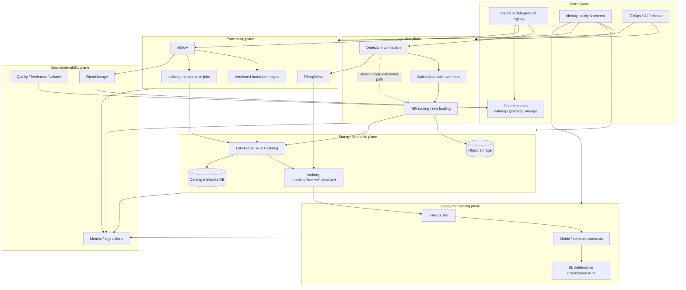

# Từ môi trường dev hiện tại tới data platform production

Tài liệu này coi toàn bộ Compose hiện tại là môi trường **dev tích hợp**. Nó đã
chứng minh được logic dữ liệu end-to-end nhưng chưa phải topology production.
Mục tiêu dưới đây là chỉ rõ phần nào được giữ, phần nào phải đổi, plane nào cần
bổ sung và cấu hình nào phải chuyển ra khỏi `.env`.

## 1. Kết luận kiến trúc

Các abstraction nên giữ nguyên khi lên production:

- Landing raw bất biến và có event identity/checksum;
- Bronze, Silver, Gold trên Apache Iceberg;
- Lakekeeper làm Iceberg REST catalog;
- Airflow điều phối finite batch job;
- Trino làm shared SQL engine;
- NiFi/Debezium cho CDC raw khi connector phù hợp;
- RisingWave cho operational streaming view;
- batch version hóa output, chạy quality gate rồi atomic publish;
- source contract, owner, classification và lineage đi cùng data product.

Production không nên chạy bằng cách copy nguyên Docker Compose lên một máy lớn.
Compose là executable specification cho dev; production cần tách service
lifecycle, identity, storage và release theo từng plane.

## 2. So sánh dev và production

| Mặt | Dev hiện tại | Production cần có |
| --- | --- | --- |
| Runtime | Một Docker host, Compose profiles | Orchestrator hoặc service platform có health, restart, rollout và placement |
| State | Named volume trên một host | Object storage và database bền vững, backup/restore đã kiểm thử |
| Credential | Một `.env`, MinIO root credential | Secret manager, service identity, rotation và least privilege |
| Network | `kest-net`, port bind loopback | Private network, TLS, DNS ổn định, ingress có policy |
| Catalog | Một Lakekeeper process, `allowall` | Lakekeeper có authn/authz, metadata DB HA và warehouse policy |
| Batch | Airflow standalone + LocalExecutor | Scheduler/web/worker tách lifecycle, remote logs và executor phù hợp tải |
| CDC | Debezium Server → HTTP NiFi, file offset | Offset/schema history bền vững; broker khi cần replay/fan-out |
| Streaming | RisingWave single node, local state | Cluster/state backend bền vững, source/sink ownership và recovery test |
| Query | Một Trino node, chưa auth | Coordinator/worker, auth, access control và resource groups |
| Quality | Check viết trong từng scenario | Contract chung, quality history, freshness/volume/schema-drift monitor |
| Governance | JSON asset/quality/OpenLineage trong S3 | Metadata catalog có search, glossary, ownership và lineage UI |
| Serving | SQL và Gold table | Semantic metric contract, BI/dashboard hoặc API theo consumer |
| Release | Sửa code rồi chạy local | CI, artifact bất biến, promotion dev → staging → production và rollback |

## 3. Target planes



### 3.1 Control plane

Control plane quản lý ý định và metadata, không chở business row. Cần bổ sung:

1. **Source registry**: manifest chuẩn cho source, table allowlist, key,
   watermark, snapshot mode, delete semantics, owner, SLA, PII và retention.
2. **Data-product registry**: input/output, grain, contract version, consumer và
   quality policy của từng Silver/Gold product.
3. **Governance catalog**: OpenMetadata là lựa chọn phù hợp với Trino, Airflow và
   OpenLineage hiện có. Chỉ chọn một trong OpenMetadata/DataHub/Atlas để tránh ba
   nguồn ownership và glossary cạnh tranh nhau.
4. **Policy và identity**: ánh xạ user/team/service account vào warehouse,
   catalog, schema, table và bucket prefix.
5. **Release control**: manifest/config/model đều qua pull request, validation và
   promotion; UI Add Source sau này chỉ ghi vào cùng registry/API.

Source registry nên là Git-backed YAML/JSON trước. Chưa cần database hay UI riêng
cho tới khi schema và lifecycle API ổn định.

### 3.2 Ingestion plane

Giữ raw contract hiện tại nhưng tách connector identity cho từng source:

- một replication slot/publication riêng theo pipeline;
- tài khoản nguồn chỉ có `REPLICATION` và `SELECT` đúng schema/table;
- initial snapshot phải có kế hoạch watermark và handoff sang CDC;
- offset và schema history nằm trên durable storage;
- event có source, table, operation, source position, event time, ingest time và
  deterministic ID;
- lỗi parse/contract đi vào quarantine/DLQ, không bị drop im lặng;
- có lệnh pause, drain, replay và drop slot an toàn.

Đường Debezium Server → HTTP NiFi vẫn dùng được nếu mỗi event chỉ có một consumer
và raw S3 là replay source. Thêm Kafka/Pulsar chỉ khi thật sự cần nhiều consumer,
buffer khi downstream dừng, ordering theo partition hoặc replay latency thấp.
Khi có broker, thêm schema registry tương ứng; trước đó JSON Schema/Avro schema
trong Git và validation tại NiFi đủ ít nợ hơn.

### 3.3 Storage và table plane

Thay MinIO single-node bằng một trong hai hướng:

- object storage managed như S3/GCS/Azure Blob; hoặc
- MinIO distributed có nhiều failure domain.

Production bucket không dùng root credential. Tách policy theo zone/domain, ví dụ:

```text
kest-prod-logistics-raw
kest-prod-logistics-lakehouse
kest-prod-platform-control
```

Nếu vẫn dùng một bucket thì ít nhất tách prefix và lifecycle policy:

```text
landing/<source>/...
bronze/<data-product>/...
warehouse/<warehouse-id>/...
control/<data-product>/...
quarantine/<source>/...
```

Bucket bật versioning, server-side encryption, lifecycle transition/expiration
và access log. Không đặt retention raw giống Iceberg metadata; hai loại có mục
đích phục hồi khác nhau.

Lakekeeper production cần:

- metadata PostgreSQL riêng, backup/PITR và connection pooling;
- OIDC/JWT authentication và authorization policy thay `allowall`;
- external base URI/TLS đúng với client;
- warehouse tách theo environment và domain hoặc security boundary;
- credential vending/delegation nếu mô hình identity hỗ trợ;
- migration chạy như release job duy nhất trước rollout server.

### 3.4 Processing và orchestration plane

Airflow production không dùng `standalone` và LocalExecutor chung một process.
Tách API/web, scheduler, DAG processor, triggerer và worker. Chọn executor theo
runtime:

- KubernetesExecutor khi mỗi task là pod/image độc lập;
- CeleryExecutor khi đã có worker queue và đội vận hành Celery;
- LocalExecutor chỉ cho môi trường nhỏ có một failure domain.

DAG vẫn phải là finite task. Debezium/NiFi/RisingWave là service dài hạn, không
chạy trong Airflow task vô hạn. Mỗi task cần owner, pool, timeout, retry policy,
idempotency key, input watermark và output batch ID.

Batch code được build thành image bất biến theo Git SHA. Airflow nhận image tag
qua release config; không bind-mount source code production. SQL model nên chuyển
dần sang dbt Core/dbt-trino hoặc model files có dependency manifest. Logic atomic
publish hiện tại vẫn giữ làm publication boundary.

### 3.5 Streaming plane

RisingWave dev đang giữ state local. Production cần:

- topology cluster được hỗ trợ và durable state/object storage;
- source credential riêng, slot ownership và WAL lag alert;
- sink contract cho output cần tồn tại ngoài RisingWave;
- recovery test từ checkpoint sau khi process/node dừng;
- reconciliation định kỳ giữa streaming view và batch snapshot;
- freshness và end-to-end event-time lag theo source/table.

Operational view có thể ở RisingWave cho truy vấn realtime. Chỉ materialize sang
Iceberg những output cần lịch sử, chia sẻ với batch/Trino hoặc audit lâu dài.

### 3.6 Query và serving plane

Trino production cần coordinator và worker tách riêng, catalog credential qua
secret provider, TLS/authentication, access-control rules, resource group, query
limit và spill/object-storage strategy phù hợp. Không cho mọi user dùng source
catalog production; phần lớn consumer chỉ thấy curated Silver/Gold.

Gold table chưa tự tạo thành semantic layer. Cần định nghĩa metric có owner,
grain, dimensions, filter và thời gian hiệu lực. Apache Superset có thể là BI UI
đầu tiên vì kết nối trực tiếp Trino. Nếu nhiều BI/app dùng cùng metric, thêm
metrics-as-code hoặc semantic service sau khi metric contract đã ổn định.

### 3.7 Governance plane

Artifact hiện có trong DeliveryOps là đầu vào, chưa phải governance platform:

- Iceberg table properties chứa owner/domain/classification;
- S3 có asset inventory và quality result;
- OpenLineage event nối source với output;
- Airflow hiển thị dependency vật lý.

OpenMetadata production sẽ thu thập metadata từ Trino, Airflow và OpenLineage,
quản lý glossary, owner, tier, tag PII, quality history và lineage UI. Cần chốt
quyền ghi metadata: source registry là nguồn owner/SLA; crawler chỉ bổ sung schema
và usage, không tự ghi đè contract do team sở hữu.

### 3.8 Data quality và observability plane

Tách hai loại quan sát:

1. **Platform observability**: process health, CPU/memory, request latency, logs,
   queue, object-store error và database connection.
2. **Data observability**: freshness, source position, CDC lag, row/byte volume,
   null/duplicate/orphan rate, schema drift, reconciliation và consumer SLA.

Mỗi batch/stream checkpoint ghi metric chuẩn vào một Iceberg control table:

```text
data_product, dataset, run_id, observed_at, watermark,
row_count, byte_count, freshness_seconds, rule_id, status, value
```

Quality gate quyết định publish; monitoring backend quyết định alert. Không để
Prometheus trở thành nơi duy nhất lưu business-quality history có retention dài.

### 3.9 Data lifecycle và reliability plane

Đây là plane còn thiếu rõ nhất ở dev. Cần một maintenance DAG có lock theo
warehouse/table để:

- expire Iceberg snapshot cũ sau thời gian rollback;
- remove orphan file với safety interval lớn hơn thời gian job tối đa;
- compact small files và rewrite manifest;
- xóa staging namespace của run thất bại;
- giữ mọi namespace đang được current pointer hoặc rollback pointer tham chiếu;
- áp raw/quarantine retention theo contract;
- kiểm tra bucket version growth;
- xác minh restore catalog metadata và object data cùng một recovery point.

Đặt RPO/RTO cho từng plane. Backup metadata catalog mà không giữ đúng object
version không tạo được một lakehouse restore nhất quán.

## 4. Chuyển cấu hình dev sang production

### 4.1 Nguyên tắc

- `.env` chỉ tồn tại ở dev; production config không chứa secret plaintext.
- Secret lấy theo runtime identity từ Vault/cloud secret manager/Kubernetes
  Secret có encryption và rotation.
- Non-secret config nằm trong Git theo environment overlay.
- Image pin bằng digest và version; release manifest ghi Git SHA, image digest,
  contract version và migration version.
- Endpoint dùng internal DNS/TLS, không dùng `127.0.0.1` hay Docker service name
  ngoài cluster boundary.

### 4.2 Mapping cấu hình

| Dev key/behavior | Production mapping |
| --- | --- |
| `MINIO_ROOT_USER/PASSWORD` | Workload identity hoặc access key riêng từng service/prefix |
| `MINIO_BUCKET` | Bucket theo environment/domain/zone và lifecycle policy |
| `LAKEKEEPER_WAREHOUSE` | Warehouse ID/name cố định trong environment config |
| `LAKEKEEPER__AUTHZ_BACKEND=allowall` | OIDC/JWT + authorization backend đã policy-as-code |
| `LAKEKEEPER__BASE_URI=http://lakekeeper:8181` | HTTPS service DNS và public/internal URI đúng client |
| `PYICEBERG_CATALOG__*__S3__*` | Catalog URI + delegated/service credential từ secret provider |
| `AIRFLOW__CORE__EXECUTOR=LocalExecutor` | KubernetesExecutor hoặc CeleryExecutor theo platform |
| Airflow local logs | Remote log bucket/index có retention |
| Airflow simple auth | Enterprise OIDC/SSO và role mapping |
| NiFi single user | TLS client/OIDC, per-process-group policy và secret parameters |
| Debezium file offset/history | Durable broker/config store hoặc durable service volume đã backup |
| RisingWave local state | Supported distributed durable state backend |
| Trino không authentication | TLS, OIDC/password auth, access control và resource groups |
| Compose profile | Environment release values/Helm/Terraform/GitOps deployment |

### 4.3 Naming convention

Tên phải encode environment nhưng business table name nên ổn định:

```text
Service account: kest-<env>-<plane>-<component>
Bucket:          kest-<env>-<domain>-<zone>
Warehouse:       <env>-<domain>
Airflow DAG:     <domain>__<data-product>__<cadence>
CDC slot:        kest_<env>_<source>_<consumer>
Publication:     kest_<env>_<source>_<consumer>
Quarantine:      quarantine/<source>/<contract-version>/...
```

Không dùng cùng CDC slot giữa dev/staging/prod hoặc giữa NiFi/RisingWave.

## 5. Promotion dev → staging → production

Một thay đổi source/model đi qua các cổng sau:

1. Validate manifest và JSON/Avro schema trong CI.
2. Compile/import DAG và SQL models.
3. Chạy unit test cho pure business rule.
4. Dựng ephemeral integration environment với dữ liệu nhỏ, bẩn có chủ đích.
5. Chạy initial snapshot, CDC handoff, duplicate/retry và schema-change test.
6. Chạy batch vào namespace staging, quality và reconciliation.
7. Kiểm OpenLineage, owner, classification và documentation completeness.
8. Promote cùng image digest/contract sang production.
9. Chạy canary source/table hoặc shadow namespace.
10. Atomic publish khi quality gate pass; rollback bằng pointer/snapshot đã giữ.

Không promote data file từ dev. Promote code, contract và release manifest; mỗi
environment đọc source và ghi warehouse của chính nó.

## 6. Thành phần cần thêm và thứ tự

### Bắt buộc trước production

1. Source/data-product registry và contract validator dùng chung.
2. Secret manager, service identity, TLS và access policy.
3. Durable object storage và metadata databases có backup/PITR.
4. Airflow deployment production cùng remote logs/artifact images.
5. Iceberg/raw lifecycle maintenance DAG.
6. Metrics, centralized logs, data freshness/CDC lag và alerting.
7. OpenMetadata hoặc một governance catalog duy nhất.
8. CI/CD, staging environment, migration và rollback workflow.

### Thêm theo nhu cầu

| Component | Khi nào cần |
| --- | --- |
| Kafka/Pulsar | Nhiều streaming consumer, buffer/replay độc lập hoặc source burst lớn |
| Schema Registry | Có broker và cần compatibility enforcement đa producer/consumer |
| dbt Core/dbt-trino | Analyst/data engineer cùng phát triển nhiều SQL model |
| Apache Superset | Cần dashboard/BI self-service qua Trino |
| Notebook gateway | Exploration nhiều user cần compute/session tách biệt |
| API serving/cache | Downstream app cần latency/concurrency khác Trino |
| Spark/Flink | Tải hoặc transformation vượt khả năng DuckDB/Trino/RisingWave hiện tại |

Không thêm đồng thời nhiều tool trùng chức năng. Lakekeeper vẫn là Iceberg REST
catalog; OpenMetadata là discovery/governance catalog, không thay Lakekeeper.
Trino là query engine; Superset là BI client, không thay Trino.

## 7. Production readiness checklist

### Source và contract

- [ ] Source/table có owner, key, watermark, delete semantics và SLA.
- [ ] Schema compatibility policy và quarantine path được kiểm thử.
- [ ] Initial snapshot → CDC handoff không mất hoặc nhân đôi business event.
- [ ] Slot/publication account, WAL cap, lag alert và cleanup runbook đã có.

### Storage và catalog

- [ ] Bucket/versioning/encryption/lifecycle/access policy được review.
- [ ] Lakekeeper authn/authz bật; `allowall` đã bỏ.
- [ ] Catalog DB backup/PITR và restore cùng object versions đã test.
- [ ] Snapshot expiry, orphan cleanup, compaction và failed-run cleanup chạy được.

### Processing

- [ ] Job image bất biến và pin bằng digest.
- [ ] Airflow task finite, idempotent, có pool/timeout/retry/owner.
- [ ] Quality failure không đổi current pointer.
- [ ] Backfill, concurrent publisher và rollback đã test.
- [ ] Streaming restart/checkpoint và batch reconciliation đã test.

### Governance và consumption

- [ ] Metadata catalog nhận schema, owner, PII, quality và lineage.
- [ ] Gold/metric có grain, công thức, timezone và consumer owner.
- [ ] Trino authentication/access control/resource group được bật.
- [ ] Consumer không truy cập source/raw ngoài policy.

### Operations và release

- [ ] Dashboard/alert có platform health và data health.
- [ ] Runbook có pause, drain, replay, rotate secret, restore và incident owner.
- [ ] RPO/RTO, retention và cost/volume budget được chốt.
- [ ] Dev/staging/prod tách credential, slot, warehouse, bucket và metadata DB.
- [ ] Migration có canary, approval boundary và rollback cụ thể.

## 8. Lộ trình ít technical debt

```text
Phase 1 — chuẩn hóa trong repo
  source manifest + contract validator
  SQL/model dependency manifest
  maintenance DAG + quality history table

Phase 2 — control và observability
  OpenMetadata + OpenLineage ingestion
  metrics/logs/alerts + schema/freshness/CDC lag
  secret/identity/TLS baseline

Phase 3 — production runtime
  durable storage/databases
  Airflow workers + immutable job images
  Trino and RisingWave production topology

Phase 4 — consumer experience
  dbt workflow
  Superset/semantic contracts
  Add Source API/UI dựa trên registry đã ổn định
```

UI không nên là bước đầu. Nếu source registry, contract và connector lifecycle
chưa ổn định, UI chỉ che code đặc thù phía sau form và làm migration khó hơn.

## 9. Tài liệu kỹ thuật chính thức

- [Apache Iceberg maintenance](https://iceberg.apache.org/docs/latest/maintenance/)
- [Apache Airflow production deployment](https://airflow.apache.org/docs/apache-airflow/stable/administration-and-deployment/production-deployment.html)
- [Trino deployment](https://trino.io/docs/current/installation/deployment.html)
- [Debezium monitoring](https://debezium.io/documentation/reference/stable/operations/monitoring.html)
- [OpenLineage specification](https://openlineage.io/docs/spec/object-model)
- [OpenMetadata documentation](https://docs.open-metadata.org/latest/)
- [Apache Superset documentation](https://superset.apache.org/docs/intro)

Các trang chính thức mô tả capability của từng component. Quyết định topology,
SLA, RPO/RTO và security boundary vẫn phải dựa trên tải và tổ chức thực tế.
