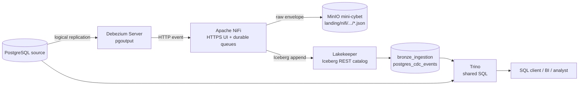

# Hướng dẫn sử dụng NiFi và Trino

Tài liệu này hướng dẫn hai thành phần tùy chọn vừa được thêm vào Kest:

- **Apache NiFi** nhận event từ connector, lưu nguyên bản vào Landing và append
  một event log vào Bronze Iceberg.
- **Trino** cung cấp một SQL endpoint dùng chung để đọc Lakehouse và PostgreSQL.

Debezium Server là bridge CDC chạy nền cho NiFi. Người dùng không cần thao tác
trên Debezium UI vì service này được cấu hình bằng biến môi trường. Các thành
phần mới nằm trong `compose.platform.yml`; chúng không thay đổi code, bảng,
replication slot hay lệnh vận hành của CyberMarket workload hiện tại.

## 1. Đường đi của dữ liệu



Một event CDC được giữ theo hai dạng:

1. Raw JSON giữ nguyên Debezium envelope tại
   `s3://mini-cybet/landing/nifi/<source>/data/<table>/<sha256>.json`.
2. Bronze event log tại
   `lakehouse.bronze_ingestion.postgres_cdc_events` giữ metadata cùng
   `before_json` và `after_json` để truy vấn bằng SQL.

`event_id` là SHA-256 của raw envelope. Consumer Bronze dùng `event_id` khi cần
khử trùng lặp. Event `c`, `u`, `d`, `r` lần lượt là create, update, delete và row
từ initial snapshot.

## 2. Chuẩn bị cấu hình

Trên checkout mới:

```sh
cp .env.example .env
chmod 600 .env
```

Thay toàn bộ placeholder trong `.env`. Riêng NiFi cần:

```dotenv
NIFI_SENSITIVE_PROPS_KEY=<chuỗi-bí-mật-dùng-để-mã-hóa-sensitive-properties>
NIFI_USERNAME=admin
NIFI_PASSWORD=<mật-khẩu-dài-ít-nhất-12-ký-tự>
INGESTION_SOURCE_NAME=postgres-source
INGESTION_HTTP_PATH=cdc/postgres-source
NIFI_LISTENER_PORT=9090
```

Không commit `.env`; file này đã được Git ignore. Image NiFi, Debezium và Trino
được khóa bằng digest trong `.env.example` để lần dựng sau dùng đúng artifact đã
kiểm thử.

Khởi động hạ tầng lõi trước. Lệnh này thực hiện migration và bootstrap
Lakekeeper:

```sh
make start
```

## 3. Khởi động và dừng platform tùy chọn

Chỉ bật NiFi và Trino:

```sh
make platform-up
```

Lệnh này:

1. đợi NiFi và Trino healthy;
2. tạo idempotent namespace `bronze_ingestion` và bảng
   `postgres_cdc_events` qua Trino;
3. tạo idempotent NiFi process group `Kest PostgreSQL CDC v1` từ code trong
   `docker/nifi/bootstrap.py`.

Sau khi đã kiểm tra cấu hình source và bảng cần capture, bật thêm CDC connector:

```sh
make platform-cdc-up
```

Kiểm tra NiFi flow và Trino catalogs:

```sh
make platform-check
```

Dừng cả ba service tùy chọn và giữ nguyên volume/state:

```sh
make platform-down
```

Nên dừng Debezium khi không ingest. Replication slot còn tồn tại để resume đúng
offset nhưng chuyển sang inactive; PostgreSQL vẫn giữ WAL từ `restart_lsn`. Theo
dõi dung lượng WAL và drop slot khi source đã được decommission có chủ đích.

## 4. Dùng Apache NiFi

### 4.1 Mở UI

Truy cập:

```text
https://127.0.0.1:8090/nifi/
```

Đăng nhập bằng `NIFI_USERNAME` và `NIFI_PASSWORD` trong `.env`. Trình duyệt sẽ
cảnh báo chứng chỉ tự ký; chứng chỉ này chỉ dùng cho local. Process group chính
là `Kest PostgreSQL CDC v1`.

Flow gồm các bước:

| Processor | Vai trò |
| --- | --- |
| Receive Debezium HTTP events | Nhận từng envelope và trả HTTP 202 |
| Hash raw envelope | Tạo `event_id` ổn định từ nội dung |
| Extract CDC metadata | Lấy schema, table, operation, LSN, timestamp, before/after |
| Set storage attributes | Tạo source name, thời điểm ingest và raw object key |
| Write immutable raw envelope | Ghi payload gốc vào bucket `mini-cybet` |
| Build stable Bronze event | Chuyển metadata thành một record có schema ổn định |
| Append Bronze Iceberg event | Append record vào Iceberg qua Lakekeeper |
| FAILED - inspect and replay | Giữ FlowFile lỗi trong queue để kiểm tra và replay |

Các S3 access key là sensitive parameters trong NiFi. Flow definition được quản
lý bằng Git qua `docker/nifi/bootstrap.py`; không cần NiFi Registry riêng cho một
flow local nhỏ. Có thể quan sát queue, processor state, bulletin và provenance
trên UI. Thay đổi thử trên UI không tự cập nhật source code.

### 4.2 Kiểm tra raw Landing

Mở MinIO Console tại `http://127.0.0.1:9001`, đăng nhập bằng
`MINIO_ROOT_USER`/`MINIO_ROOT_PASSWORD`, rồi đi tới:

```text
mini-cybet/
  landing/
    nifi/
      postgres-source/
        data/
          <source-table>/
            <event-sha256>.json
```

Object raw phải giữ đủ `before`, `after`, `source`, `op` và transaction metadata
mà Debezium gửi. Không sửa object bằng tay. Replay đọc lại raw envelope, giữ
nguyên `event_id`, rồi ghi lại output theo quy tắc dedup của consumer.

### 4.3 Kiểm tra Bronze từ NiFi

Trên NiFi UI:

1. Mở process group `Kest PostgreSQL CDC v1`.
2. Xác nhận tất cả processor có trạng thái Running.
3. Xem queue giữa các processor; queue tăng liên tục thường là sink chậm hoặc lỗi.
   Processor `FAILED - inspect and replay` được dừng có chủ đích để queue lỗi
   không bị tiêu thụ hoặc xóa âm thầm.
4. Xem bulletin trên `Write immutable raw envelope` nếu MinIO lỗi.
5. Xem bulletin trên `Append Bronze Iceberg event` nếu catalog/table lỗi.
6. Dùng Data Provenance, lọc theo `event_id` hoặc `source_table`, để lần theo một
   event.

CLI tương đương:

```sh
make platform-check
```

### 4.4 Thêm một PostgreSQL source mới

Thiết kế hiện tại dùng **một Debezium Server cho một source connector**. Cách này
giữ slot, offset, schema history và lifecycle tách biệt. Ví dụ thêm source
`erp-orders`:

1. Lập source contract: owner, hostname, database, table, primary key, volume,
   freshness, delete semantics, retention và dữ liệu nhạy cảm.
2. Trên PostgreSQL source, bật `wal_level=logical`, cấp `LOGIN`, `SELECT` và
   `REPLICATION` cho một service account riêng.
3. Chọn slot/publication duy nhất, ví dụ `kest_erp_orders`.
4. Tạo một Compose override cho một service Debezium mới. Không sửa service của
   `postgres-source` nếu nó vẫn đang được dùng.
5. Copy NiFi process group hiện có, gán parameter context riêng, đổi
   `source.name`, listener port và HTTP base path.
6. Đổi URL sink của Debezium tới đúng path mới.
7. Tạo Bronze table/namespace theo contract nếu không dùng event log chung.
8. Bật NiFi flow trước, sau đó mới bật Debezium.
9. Kiểm tra initial snapshot, rồi phát đúng một insert, update và delete trên một
   bảng probe riêng.
10. Đối chiếu source event, raw object, Bronze row và replication slot trước khi
    cho capture bảng thật.

Ví dụ phần cấu hình quan trọng của service Debezium mới:

```yaml
services:
  debezium-erp-orders:
    image: ${DEBEZIUM_SERVER_IMAGE}
    environment:
      DEBEZIUM_SINK_TYPE: http
      DEBEZIUM_SINK_HTTP_URL: http://nifi:9091/cdc/erp-orders
      DEBEZIUM_SINK_HTTP_BATCH_ENABLED: "false"
      DEBEZIUM_SOURCE_CONNECTOR_CLASS: io.debezium.connector.postgresql.PostgresConnector
      DEBEZIUM_SOURCE_DATABASE_HOSTNAME: erp-db.internal
      DEBEZIUM_SOURCE_DATABASE_PORT: "5432"
      DEBEZIUM_SOURCE_DATABASE_DBNAME: erp
      DEBEZIUM_SOURCE_DATABASE_USER: ${ERP_CDC_USER}
      DEBEZIUM_SOURCE_DATABASE_PASSWORD: ${ERP_CDC_PASSWORD}
      DEBEZIUM_SOURCE_PLUGIN_NAME: pgoutput
      DEBEZIUM_SOURCE_SLOT_NAME: kest_erp_orders
      DEBEZIUM_SOURCE_PUBLICATION_NAME: kest_erp_orders
      DEBEZIUM_SOURCE_PUBLICATION_AUTOCREATE_MODE: filtered
      DEBEZIUM_SOURCE_TABLE_INCLUDE_LIST: public.orders,public.order_items
      DEBEZIUM_SOURCE_SNAPSHOT_MODE: initial
```

Service thực tế còn cần file offset/schema-history volume giống service mẫu
trong `compose.platform.yml`. Với source production, publication nên được DBA
quản lý rõ ràng thay vì để connector tự mở rộng ngoài table allowlist.

### 4.5 Cấu hình source mẫu hiện có

Service `debezium-postgres` mặc định trỏ tới `postgres-source` và chỉ capture:

```dotenv
DEBEZIUM_SLOT_NAME=kest_nifi
DEBEZIUM_PUBLICATION_NAME=kest_nifi
DEBEZIUM_TABLE_INCLUDE_LIST=ingestion_demo.cdc_probe
```

`ingestion_demo.cdc_probe` là tên an toàn cho một bảng probe tách khỏi workload;
repository không tự tạo bảng này khi vận hành bình thường. Trước khi chạy
`make platform-cdc-up`, đổi allowlist sang bảng đã được duyệt hoặc tự tạo bảng
probe riêng. Mỗi lần đổi connector identity/allowlist lớn, xem lại offset,
publication và snapshot plan; không tái dùng tùy tiện volume offset của source
khác.

## 5. Dùng Trino

### 5.1 Catalog có sẵn

Trino mở HTTP endpoint tại `http://127.0.0.1:8081` và có ba catalog:

| Catalog | Nội dung |
| --- | --- |
| `lakehouse` | Iceberg qua Lakekeeper, data file trong MinIO |
| `source` | PostgreSQL `postgres-source` để kiểm tra/đối chiếu |
| `system` | Metadata/runtime của Trino |

Mở Trino CLI trong container:

```sh
make platform-sql
```

Hoặc chạy một câu lệnh không tương tác:

```sh
docker compose -f docker-compose.yml -f compose.platform.yml --profile platform \
  exec -T trino trino --execute 'SHOW CATALOGS'
```

### 5.2 Truy vấn Bronze

```sql
SHOW SCHEMAS FROM lakehouse;
SHOW TABLES FROM lakehouse.bronze_ingestion;

SELECT source_schema,
       source_table,
       operation,
       count(*) AS event_count
FROM lakehouse.bronze_ingestion.postgres_cdc_events
GROUP BY 1, 2, 3
ORDER BY 1, 2, 3;
```

Xem payload mới nhất:

```sql
SELECT event_id,
       operation,
       source_lsn,
       captured_at,
       before_json,
       after_json
FROM lakehouse.bronze_ingestion.postgres_cdc_events
WHERE source_table = 'orders'
ORDER BY try_cast(source_ts_ms AS bigint) DESC
LIMIT 20;
```

Khử trùng lặp event log khi dựng một view trung gian:

```sql
SELECT *
FROM (
    SELECT e.*,
           row_number() OVER (
               PARTITION BY event_id
               ORDER BY try_cast(source_ts_ms AS bigint) DESC
           ) AS occurrence
    FROM lakehouse.bronze_ingestion.postgres_cdc_events e
)
WHERE occurrence = 1;
```

### 5.3 Đối chiếu với source

Trino có thể query chéo PostgreSQL và Iceberg trong một câu SQL:

```sql
SELECT b.operation, count(*) AS bronze_events
FROM lakehouse.bronze_ingestion.postgres_cdc_events b
WHERE b.source_table = 'cdc_probe'
GROUP BY b.operation;

SELECT count(*) AS current_source_rows
FROM source.ingestion_demo.cdc_probe;
```

Đây là hai lần đọc từ hai hệ thống, không phải một distributed transaction. Khi
source đang thay đổi, chốt watermark/LSN trước khi reconciliation cần kết quả
nhất quán.

### 5.4 Transform bằng SQL

Trino có thể tạo namespace/table Iceberg và chạy CTAS cho transform dùng chung:

```sql
CREATE SCHEMA IF NOT EXISTS lakehouse.silver_erp;

CREATE TABLE lakehouse.silver_erp.order_events AS
SELECT event_id,
       operation,
       source_lsn,
       from_unixtime(try_cast(source_ts_ms AS bigint) / 1000.0) AS source_at,
       before_json,
       after_json
FROM lakehouse.bronze_ingestion.postgres_cdc_events
WHERE source_schema = 'public'
  AND source_table = 'orders';
```

Đối với pipeline có publish contract, job phải ghi vào table/version mới, chạy
data-quality checks rồi mới publish pointer hoặc view cho consumer. Tránh để user
chạy `INSERT`, `DELETE`, `DROP` trực tiếp vào table đang phục vụ production.

### 5.5 Kết nối SQL client hoặc BI

Endpoint JDBC:

```text
jdbc:trino://127.0.0.1:8081/lakehouse/bronze_ingestion
```

Cấu hình local hiện chưa bật authentication cho Trino và port chỉ bind vào
loopback. DBeaver, Superset hoặc client JDBC chạy cùng máy có thể kết nối bằng
một username tùy ý. Trước khi mở ra network dùng chung cần cấu hình TLS,
authentication, authorization và user mapping.

Thêm một source SQL catalog mới bằng cách tạo file riêng dưới
`docker/trino/etc/catalog/<catalog-name>.properties`, dùng biến môi trường cho
credential, rồi restart Trino. Một catalog tương ứng một cấu hình connector;
không ghi password trực tiếp vào file được commit.

## 6. Kiểm tra và xử lý lỗi

### NiFi không truy cập được

```sh
docker compose -f docker-compose.yml -f compose.platform.yml --profile platform ps nifi
docker compose -f docker-compose.yml -f compose.platform.yml --profile platform logs --tail=100 nifi
```

Đợi trạng thái healthy, dùng URL `https://`, kiểm tra port 8090 và đăng nhập bằng
credential trong `.env`.

### Debezium unhealthy

```sh
docker compose -f docker-compose.yml -f compose.platform.yml --profile platform logs --tail=150 debezium-postgres
```

Kiểm tra hostname, credential, table allowlist, quyền replication, `pgoutput`,
slot/publication trùng tên và NiFi listener. Không xóa slot trước khi xác định
offset đã được xử lý tới đâu.

### Raw có nhưng Bronze chưa có

Mở NiFi bulletin của processor `Append Bronze Iceberg event`, rồi kiểm tra
Lakekeeper, MinIO và table:

```sh
make platform-check
docker compose -f docker-compose.yml -f compose.platform.yml --profile platform \
  exec -T trino trino --execute \
  'SELECT count(*) FROM lakehouse.bronze_ingestion.postgres_cdc_events'
```

### Trino không thấy namespace/table

```sql
SHOW SCHEMAS FROM lakehouse;
SHOW TABLES FROM lakehouse.bronze_ingestion;
```

Kiểm tra Lakekeeper healthy, warehouse trong `.env` khớp warehouse bootstrap và
Trino đã chạy lại sau khi config catalog thay đổi.

## 7. Ranh giới của bản local

NiFi đang dùng single-user HTTPS, Lakekeeper dùng local allow-all, Trino chưa có
authentication và các service dùng MinIO root credential. Đây là cấu hình để
phát triển local. Production cần service identity riêng, secret manager, TLS/OIDC,
RBAC, audit, alert cho CDC lag/WAL, backup/restore, retention và nhiều replica nếu
SLA yêu cầu.

NiFi cung cấp canvas để operator quản lý flow; nó chưa phải một Add Source portal
cho analyst. Source onboarding vẫn cần source contract, quyền truy cập, connector
config, schema mapping và kiểm thử. Trino là shared SQL engine; nó không thay thế
orchestration, catalog hoặc ingestion.
